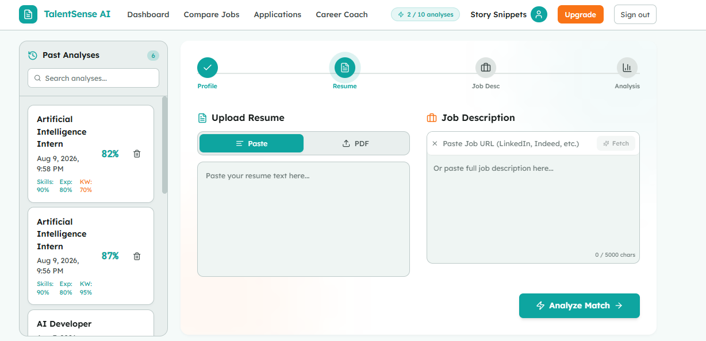
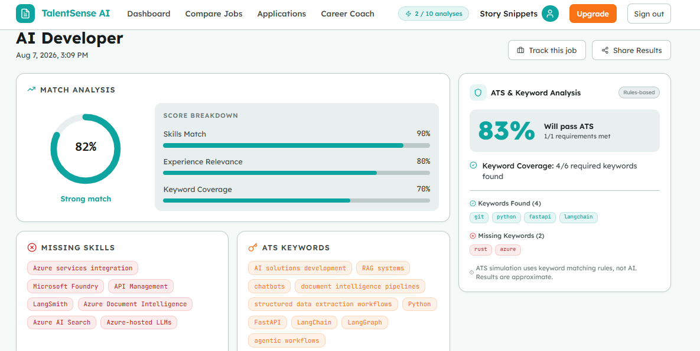
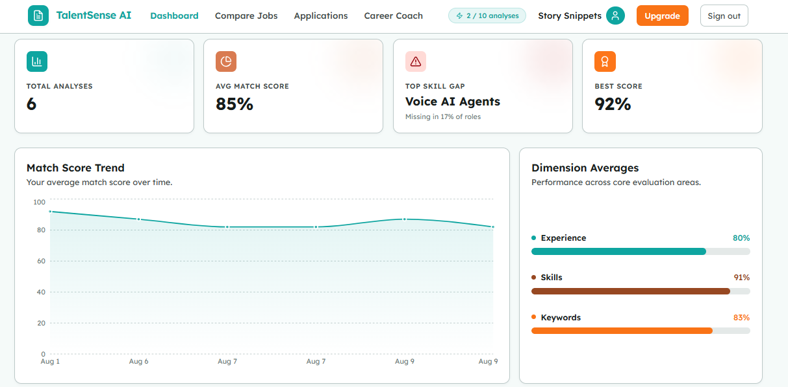
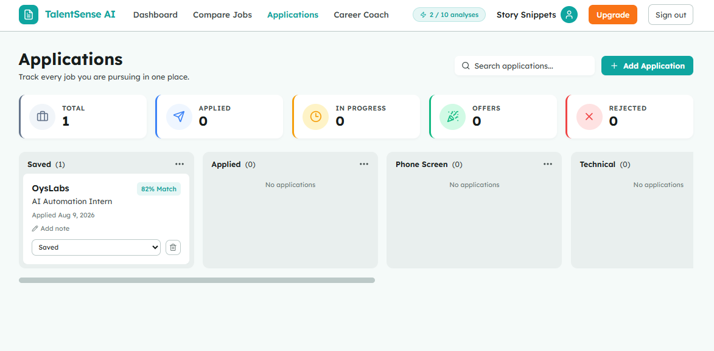

# TalentSense AI — Resume & Job Match Analyzer

> AI-powered SaaS that scores how well your resume matches any job description — with an ATS simulator, multi-JD comparison, learning roadmaps, a LangGraph career coach, a job application tracker, shareable analysis pages, and a Chrome extension that analyzes directly from job boards.

[](https://talentsenseai.vercel.app)


---

## Screenshots

| Home / Analyzer | Results & ATS |
|---|---|
|  |  |
| **Dashboard** | **Applications Board** |
|  |  |

---

## Highlights

- **Match score in seconds** — 4-dimension scoring (skills, experience, keywords, ATS) with an explanation of exactly what to fix.
- **ATS Simulator** — rules-based keyword pass/fail checks plus an LLM-scored report.
- **Compare up to 3 jobs** against one resume and see the best-fit role.
- **Learning Roadmap** — a personalized, resource-backed plan for every missing skill (Tavily search + caching).
- **AI Career Coach** — multi-turn LangGraph assistant that remembers your history.
- **Application Tracker** — kanban board across 7 pipeline stages, prefilled straight from an analysis.
- **Account & Resume Storage** — store up to 3 resumes (text or PDF) in the Account page; newest-first, auto-evicts oldest.
- **Viral share links** — opt-in public results pages with a blur-to-signup conversion loop.
- **Chrome Extension** — analyze any job page from LinkedIn, Indeed, or Naukri without leaving the browser.
- **Production-grade basics** — Clerk auth, MongoDB-backed rate limiting, prompt-injection defense, Sentry, and 117 passing tests.

---

## Chrome Extension

A Plasmo MV3 extension that lives in the browser's side panel and talks to the same backend API as the web app.

**Key features:**
- **Auto-fetch job description** — extract the JD from LinkedIn, Indeed, or Naukri via content script injection (falls back to `chrome.scripting.executeScript` when the content script isn't loaded).
- **Saved resumes dropdown** — pull up to 3 resumes stored in the Account page; no re-upload required.
- **Step-by-step analysis tracker** — real-time progress: fetch resume → send to server → AI analysis (with elapsed timer).
- **Manual JD paste** — fallback textarea when auto-extraction isn't possible.
- **Long-lived Clerk tokens** — works with a JWT template (`extension`) that stays valid for weeks instead of the default 60-second session token.

### Quick start (load unpacked)

```bash
cd extension
npm install
npm run build
```

Then at `chrome://extensions` → enable **Developer mode** → **Load unpacked** → select `extension/build/chrome-mv3-prod`.

First use: open a job page on LinkedIn / Indeed / Naukri → click **⚡ Analyze Match** → paste a Clerk token in the side panel.

For full deployment (Edge Add-ons, Chrome Web Store, private distribution), see **[EXTENSION_DEPLOYMENT.md](EXTENSION_DEPLOYMENT.md)**.

---

## Tech Stack

| Layer | Tech |
|---|---|
| **Frontend** | React 18, TypeScript, Vite, Tailwind CSS, React Query, Recharts, Clerk |
| **Backend** | Python 3.11, FastAPI, LangChain + Groq (analysis), LangGraph (coach), Motor/MongoDB |
| **AI / Search** | Groq LLM, Qdrant vector search, Tavily web search, sentence-transformers |
| **Data** | MongoDB (usage, history, resumes, applications, caches), Qdrant (vectors) |
| **Extension** | Plasmo MV3, TypeScript, React, `chrome.scripting` + content scripts |
| **Payments** | Stripe checkout + webhooks (pro tier scaffolded) |
| **Infra** | Docker, Render (backend), Vercel (frontend), GitHub Actions (CI) |

---

## Architecture

```
┌────────────────────────────────────────────────────────────────┐
│  Frontend (Vercel)                                              │
│  React + Clerk Auth → React Query → /api/v1/*                   │
│  Home · Results · Compare · Dashboard · Coach · Applications     │
│  Account (resume store) · Share pages · Chrome Extension (API)   │
└─────────────────────────────────┬───────────────────────────────┘
                                  │ HTTPS + Authorization: Bearer <jwt>
┌─────────────────────────────────▼───────────────────────────────┐
│  Backend (Render) — FastAPI                                      │
│  Clerk JWT → rate limit → sanitizer → analysis pipeline          │
│  ├─ /analyze        LangChain/Groq + ATS + Qdrant + signals     │
│  ├─ /compare        Multi-JD comparison                         │
│  ├─ /learning-plan  Roadmaps via Tavily                         │
│  ├─ /coach/chat     LangGraph career coach                      │
│  ├─ /resumes        Store up to 3 resumes (text/PDF)            │
│  ├─ /applications   Tracker CRUD · /share public pages          │
│  └─ /history, /billing, /webhooks/clerk                         │
│  MongoDB · Qdrant · training-signal collection                  │
└─────────────────────────────────────────────────────────────────┘
```

---

## Getting Started

### 1. Backend

```bash
cd backend
python -m venv .venv
.venv\Scripts\activate            # Windows (POSIX: source .venv/bin/activate)
pip install -r requirements.txt
copy .env.example .env            # add your keys (Clerk, Groq, MongoDB, Qdrant…)
.venv\Scripts\python.exe -m uvicorn app.main:app --reload --port 8000
```

### 2. Frontend

```bash
cd frontend
npm install
copy .env.example .env            # VITE_API_BASE_URL, VITE_CLERK_PUBLISHABLE_KEY
npm run dev
```

Open `http://localhost:5173`.

### 3. Chrome Extension (optional)

```bash
cd extension
npm install
npm run build
```

Load `extension/build/chrome-mv3-prod` as an unpacked extension at `chrome://extensions`.
Point `extension/.env` at your deployed backend URL (see `extension/.env.example`).

---

## Environment Variables

Full reference is in each folder's `.env.example`:

- `backend/.env.example` — Clerk, Groq, MongoDB, Qdrant, Tavily, Resend, Sentry, rate-limit window.
- `frontend/.env.example` — `VITE_API_BASE_URL`, `VITE_CLERK_PUBLISHABLE_KEY`.
- `extension/.env.example` — `PLASMO_PUBLIC_API_BASE`, `PLASMO_PUBLIC_APP_URL`.

---

## Testing

```bash
# Backend — 117 unit + integration tests
cd backend
.venv\Scripts\python.exe -m pytest tests -q -p no:cacheprovider

# Frontend — typecheck, lint, and production build
cd frontend
npx tsc -b
npm run lint
npm run build
```

CI runs backend tests on every push/PR (`.github/workflows/test.yml`).

---

## Deployment

Render backend + Vercel frontend + Chrome extension. See **[DEPLOYMENT.md](DEPLOYMENT.md)** for the full production guide and checklist.

For the Chrome extension specifically (build, package, and free distribution via Edge Add-ons / Chrome Web Store / load-unpacked), see **[EXTENSION_DEPLOYMENT.md](EXTENSION_DEPLOYMENT.md)**.

---

## Project Structure

```
resume-job-analyzer/
├── backend/              # FastAPI app (routes, services, models, tests, scripts)
│   ├── app/
│   │   ├── api/          # /api/v1 routes + legacy aliases, auth deps
│   │   │   └── routes/   # analysis, applications, billing, coach, compare,
│   │   │                 # history, learning, resumes, scrape, sharing, webhooks
│   │   ├── services/     # chain, coach_agent, sanitizer, ats, qdrant, rate_limit,
│   │   │                 # resume_service, parser, training_data_service, user_service
│   │   ├── core/         # config, logging, monitoring
│   │   └── main.py
│   ├── scripts/          # fine-tuning pipeline (export → pairs → finetune)
│   └── tests/            # 117 passing tests
├── frontend/             # React + Vite + TypeScript SPA
│   └── src/
│       ├── components/   # ResultView, ATSScoreCard, LearningRoadmap, HistorySidebar…
│       ├── hooks/        # useUsage, useDashboard, useApplications, useCoach, useResumes…
│       ├── lib/          # api.ts (fetchResumes, createResume, deleteResume), validators.ts
│       └── pages/        # Home, Results, Compare, Dashboard, Coach, Applications,
│                         # Account, History, Pricing, SignIn/SignUp, ShareView…
├── extension/            # Plasmo MV3 Chrome extension
│   ├── background.ts     # Side-panel open + pending-analysis storage
│   ├── contents/         # inject-button.tsx (⚡ on job pages, FETCH_JD listener)
│   └── sidepanel.tsx     # Resume selector, step tracker, JD auto-fetch + manual paste
├── screenshots/          # UI captures for this README
├── DEPLOYMENT.md         # production deployment guide
├── EXTENSION_DEPLOYMENT.md # extension build, packaging, distribution
└── LICENSE               # MIT
```

---

## License

[MIT](LICENSE)
